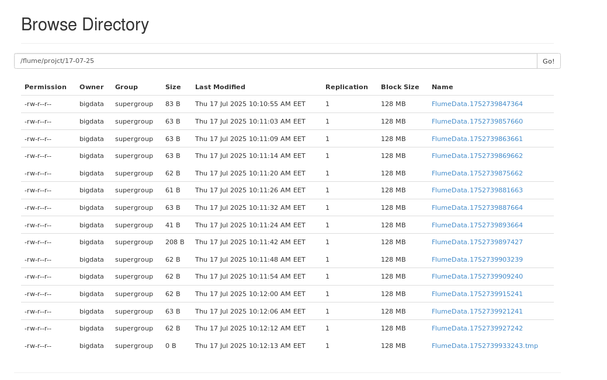

> [!NOTE]  
> i assume you have hadoop, spark and flume installed in your machine

# 1- start hdfs  & yarn
```bash
start-dfs.sh
start-yarn.sh
```

# 2- move conf file
put `project.conf`  in the directory of `apache-flume-{version}-bin/conf`

# 3- run python script that generate logs
```bash
python project-script.py
```

# 4-run flume agent to save data in Hadoop
```
$FLUME_HOME/bin/flume-ng agent -c $FLUME_HOME/conf/ -f $FLUME_HOME/conf/project.conf --name a1 -Dflume.root.logger=INFO,console
```

> [!NOTE]  
> this is a single command not a separate one

# 5- run project.ipynb
```bash
jupyter notebook project.ipynb
```

# logs file stored in hdfs

logs are stored in `/flume/project/{today's date}`




>[!Note]
>You can look for the analysis of logs at `project.ipynb` where you can see how many did every person sent message


